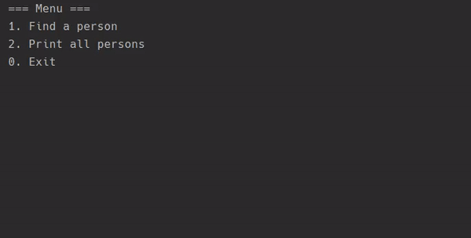

# Simple Search Engine
- https://hyperskill.org/projects/89?track=3

***

## About 

About
In this project you will create your own search engine, though it probably won’t compete with Google. Yours will be a simple search engine that processes a limited collection of data and searches it for a word or a phrase. It’ll be simple but cool.

## [Theory]

- [Introduction to Kotlin](theory/introduction-to-kotlin.md)
- [Basic Literals](theory/basic-literals.md)
- [Values and variables](theory/values-and-variables.md)
- [Data Types](theory/data-types.md)
- [The classification of basic types](theory/the-classification-of-basic-types.md)
- [Standard Output](theory/standard-output.md)
- [Arithmetic Operations](theory/arithmetic-operations.md)
- [Boolean and logical operations](theory/boolean=and-logical-operations.md)
- [Increment and decrement](theory/increment-and-decrement.md)
- [Invoking functions](theory/invoking-function.md)
- [Standard Input](theory/standard-input.md)
- [Type Conversion](theory/type-conversion.md)
- [Reading data with a readLine](theory/reading-data-with-a-readLine.md)
- [Objects](theory/objects.md)
- [Type of the numeric expression](theory/type-of-the-numeric-expression.md)
- [Integers in action](theory/integer-in-action.md)
- [Relational operators](theory/relational-opeators.md)
- [Declaring Functions](theory/declaring-functions.md)
- [Equality](theory/equality.md)
- [Errors in programs](theory/erros-in-programs.md)
- [What is an Exception](theory/what-is-an-exception.md)
- [Design Principle](theory/design-principle.md)
- [Single Responsibility Principle](theory/single-responsibility-principle.md)
- [The concept of pattern](theory/the_concept_of_pattern.md)
- [String basics](theory/string_basics.md)
- [String templates](theory/string_templates.md)
- [If expression](theory/if_expression.md)
- [Repeating blocks](theory/reapting_blocks.md)
- [Declaring classes](theory/declaring_classes.md)
- [Introduction software architecture](theory/introduction_software_architecture.md)
- [Navigation through code](theory/navigation_through_code_Intellij.md)
- [Writing code with pleasure](theory/writing_code_with_pleasure_intellij.md)
- [Computer algorithms](theory/computer_algorithms.md)
- [Call stack](theory/call-stack.md)
- [Introduction to creational patterns](theory/introduction_to_creational_patterns.md)
- [Singleton](theory/singleton.md)
- [Write, compile, and run](theory/write_compile_and_run.md)
- [JVM components](theory/jvm_components.md)
- [Garbage collector](theory/garbage_collector.md)
- [Class Loader](theory/class_loader.md)
- [Binary numbers](theory/binary_numbers.md)
- [Hexadecimal numbers](theory/hexadecimal_numbers.md)
- [Characters](theory/characters.md)
- [Unicode](theory/unicode.md)
- [Working with strings](theory/working_with_strings.md)
- [Getting substrings](theory/getting_substrings.md)
- [Ranges](theory/ranges.md)
- [When expression](theory/when_expression.md)
- [For loop and ranges](theory/for_loop_and_ranges.md)
- [Functional decomposition](theory/functional_decomposition.md)
- [Default arguments](theory/default_arguments.md)
- [Named arguments](theory/names_arguments.md)
- [Constructors](theory/constructors.md)
- [Member functions](theory/member_functions.md)
- [Object declarations](theory/object_declarations.md)
- [Debugging techniques](theory/debugging_techniques.md)
- [Debugging overview](theory/debugging_overview.md)
- [Debugging simple constructs](theory/debugging_simple_constructs.md)
- [Advanced Debugger features](theory/advanced_debugger_feature.md)
- [Introduction to MutableList](theory/introduction_to_mutableList.md)
- [Work with MutableLists](theory/work_with_mutableLists.md)
- [For loop and lists](theory/for_loop_and_lists.md)
- [Processing strings](theory/processing_strings.md)
- [Searching Problem](theory/searching_problem.md)
- [Pseudocode](theory/pseudocode.md)
- [Linear search](theory/linear_search.md)
- [Jump search](theory/jump_search.md)
- [Null safety](theory/null_safety.md)
- [Functions as objects](theory/function_as_objects.md)
- [Lambda expressions](theory/lambda_expressions.md)
- [Introduction to operating systems](theory/introduction_to_operating_systems.md)
- [Files](theory/files.md)
- [Reading files](theory/reading_files.md)
- [Command line overview](theory/command_line_overview.md)
- [Arrays](theory/arrays.md)
- [String arrays](theory/string_arrays.md)
- [The main() function](theory/the_main_function.md)
- [Creating custom exceptions](theory/creating_custom_exceptions.md)
- [Functional references](theory/functional_references.md)
- [Thread as object](theory/thread_as_object.md)
- [Custom threads](theory/custom_thread.md)
- [Thread management](theory/thread_management.md)
- [Exception in threads](theory/exceptions_in_threads.md)
- [Companion object](theory/companion_object.md)