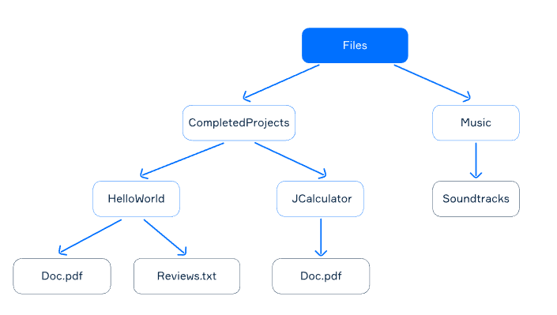

# Theory: File hierarchies

> To structure the data you store on a disk, files can be organized into directories. A parent directory can include other directories, that is, subdirectories, which results in a hierarchy of files. For example, consider the filesystem hierarchy in Linux: the root directory / includes all other files and directories, even if they are stored on different physical devices.

- 디렉토리에 대해서 알려주는듯. 
***

## Files and Directories

> A file is a named data area on a storage medium used as the basic object of interaction with data in operating systems.
> 
> A directory is an entity in a file system that simplifies the organization of files. A typical file system contains a large number of files, and directories help organize it by grouping them together.
>
> Kotlin offers a number of methods to operate with directories and files. You may, for example, use the java.io library.
>
> Let's consider the most popular of these methods:
>
> - File.isDirectory checks if the File is a directory.
> - File.isFile checks if the File is a file.
> - File.exists() checks if the file exists.
> - File.resolve(String) returns a file named String in a directory.
> - File.resolve(File) returns a file File in a directory.
> - File.createNewFile() creates a new file.
> - File.mkdirs() creates a directory.
>
> Here's an example:
>
> ```kotlin
> val outDir = File("outDir")
> println(outDir.exists())    // false
> outDir.mkdir()
> println(outDir.exists())    // true
> println(outDir.isDirectory) // true
> 
> val file = outDir.resolve("newFile.txt") // outDir/newFile.txt
> println(file.exists())      // false
> file.createNewFile()        
> println(file.exists())      // true
> println(file.isFile)        // true 
> ```

- 파일은 운영체제에서 다루는 가장 기본 단위
- 디렉토리는 파일 조직을 다루기 위한 것
- 자바에서는 파일과 관련된 다양한 메소드를 지원해준다.
  - isDirectory() 는 디렉토리인지 확인해주는 메소드
  - isFile 은 파일인지 확인해주는 메소드
  - exists() 는 파일이 존재하는지 확인해주는 메소드
  - resolve(path) 는 디렉토리에서 파일을 가지고 오는 메소드
  - createNewFile() 은 파일을 마드는 메소드
  - mkdirs() 는 디렉토리를 만드는 메소드

***

## Methods for Iterating through file hierarchies

> You can iterate through file hierarchy with the java.io.File methods:
>
> - File.getParentFile() returns an instance of java.io.File representing the parent directory of a file or null if this file does not have a parent (which means it is the root).
> - File.getParent() returns a string representation of the parent directory of a file or null if this file does not have a parent.
> - File.listFiles() returns an array of files located in a given directory or null if this instance is not a directory.
> - File.list() returns an array of files and directories in the directory defined by this abstract pathname.
> 
> kotlin.io provides special methods that allow you to iterate through the entire file hierarchy. Let's look at three basic methods:
> - File.walk(direction): FileTreeWalk provides the directories and files we can visit in this directory; we need to specify how exactly we will iterate (up or down the hierarchy structure);
> - File.walkBottomUp(): FileTreeWalk provides the directories and files we can visit in this directory. It uses depth-first search, and directories are visited after all their files;
> - File.walkTopDown(): FileTreeWalk provides the directories and files we can visit in this directory. We use a depth-first search, and the directories are visited before all their files.
>
> The FileTreeWalk class is used to iterate through a given file system. It allows you to iterate through all files within a given directory. The iterator method returns an iterator traversing the files. You may iterate over this structure or convert it to a list with the toList() function.
>
> In the following section, we'll find out how to apply these methods when dealing with a simple hierarchy.

- java.io.File 에서는 계층을 순회하기 위한 메소드를 지원해준다.
  - File.getParentFile() 메소드를 통해서 parent 디렉토리를 File 객체로 리턴해준다. (루트부터 아래로 내려온다고 생각하면 됨.) 
  - File.getParent() 메소드를 통해서 parent 디렉토리를 String 형태로 리턴해준다.
  - File.listFiles() 메소드를 통해서 주어진 디렉토리에 있능 모든 File 을 어레이 형식으록 가지고온다. 없으면 null
  - File.list() 메소드를 통해서 주어진 디렉토리에 있는 모든 File 과 Directory 를 가지고온다.
- kotlin.io 에서는 파일 순회를 위해서 추가적인 메소드를 제공해준다.
  - File.walk(direction) 는 File 순회를 위핸 FileTreeWalk 를 제공해주며 File 과 Directory 를 순회할 수 있게 해준다. 여기에는 인자로 방향을 줘야한다.
  - File.walkBottomUp() 과 File.walkTopDown() 은 파일 순회를 위해 FileTreeWalk 를 제공해주는데 방향까지 제공해주는 것.
  - FileTreeWalk 에서 toList() 함수로 리스트 형식으로 변환도 가능하다.
  - 예는 아래에서 보자.

***

## A hierarchy example

> Let's consider a file hierarchy with the root directory named Files. It contains two subdirectories: CompletedProjects and Music. They also have subdirectories: the HelloWorld directory contains two files related to the project, the JCalculator directory contains only one file, and theSoundtracks directory is empty.
>
> Take a look at the illustration of this hierarchy below:
>
> 
> 
> In the following paragraphs, we will use this file hierarchy in examples that illustrate methods of working with the file system.

***

## Getting directory contents and directory's/file's parent

> listFiles() prints the contents (files and directories) of a chosen directory.
>
> ```kotlin
> val helloWorld = File("/Files/CompletedProjects/HelloWorld")
> val helloWorldFilesNames = helloWorld.listFiles().map{it.name} // [Doc.pdf, Reviews.txt]
> 
> val reviews = File("/Files/CompletedProjects/HelloWorld/Reviews.txt")
> val reviewsFiles = reviews.listFiles() // null
> 
> val soundtracks = File("/Files/Music/SoundTracks")
> val soundtracksFiles = soundtracks.listFiles() // []
> ```
>
> The reviewsFiles is null because reviews is not a directory at all and cannot include other files or subdirectories. Meanwhile, sountracks is a directory without files, so the result will be an empty array.
>
> TheFile.parentFile method returns a file's or directory's parent as File.
>
> ```kotlin
> val files = File("/Files")
> print(files.parent) // the result is "/"
> print(files.parentFile.name) // the result is ""
> 
> val reviews = File("/Files/CompletedProjects/HelloWorld/Reviews.txt")
> print(reviews.parent) // the result is "/Files/CompletedProjects/HelloWorld"
> print(reviews.parentFile.name) // the result is "HelloWorld"
> 
> val root = File("/")
> print(root.parent) // the result is "null"
> print(root.parentFile.name) // throws java.lang.NullPointerException
> ```
>
> As you can see, if a directory is the root of a file hierarchy, you will get null. Be careful to not get exceptions!

- listFiles() 를 통해서 파일을 가져올 수 있다.
- 주의할 건 파일에서 listFiles() 를 하는 경우에는 null 이 리턴될 것이고 디렉토리에서 listFiles() 를 해야 파일 리스트가 나올 것이다.
- 생각해보면 당연함.
- File.parent 를 호출하면 parent Directory 가 리턴된다. 
- 루트 디렉토리의 name 을 보면 "" 이다.
- 루트 디렉토리에서 parent 를 가면 null 이 나온다.

***

## Iterating in both directions

> We have already mentioned the File.walk(direction) method for iterating through file hierarchy. The attribute direction describes the way in which we can traverse our file hierarchy; it can take two values: FileWalkDirection.BOTTOM_UP and FileWalkDirection.TOP_DOWN.
>
> ```kotlin
> val files: File = File("/Files")
> println("TOP_DOWN: ")
> files.walk(FileWalkDirection.TOP_DOWN).forEach { println(it) }
> 
> println("BOTTOM_UP: ")
> files.walk(FileWalkDirection.BOTTOM_UP).forEach { println(it) }
> ```
> 
> The results of this program will be the following:
>
> ```kotlin
> TOP_DOWN:
> /Files
> /Files/Music
> /Files/Music/SoundTracks
> /Files/CompletedProjects
> /Files/CompletedProjects/HelloWorld
> /Files/CompletedProjects/HelloWorld/Doc.pdf
> /Files/CompletedProjects/HelloWorld/Reviews.txt
> /Files/CompletedProjects/JCalculator
> /Files/CompletedProjects/JCalculator/Doc.pdf
> BOTTOM_TOP:
> /Files/Music/SoundTracks
> /Files/Music
> /Files/CompletedProjects/HelloWorld/Doc.pdf
> /Files/CompletedProjects/HelloWorld/Reviews.txt
> /Files/CompletedProjects/HelloWorld
> /Files/CompletedProjects/JCalculator/Doc.pdf
> /Files/CompletedProjects/JCalculator
> /Files/CompletedProjects
> /Files
> ```
> 
> You can get the same result with the following methods:
> - File.walkBottomUp() (analogous to File.walk(FileWalkDirection.BOTTOM_UP));
> - File.walkTopDown() (analogous to File.walk(FileWalkDirection.TOP_DOWN)).
> 
> Thus, these three methods allow us to recursively traverse the entire file structure.

- File.walk(FileWalkDirection.TOP_DOWN) 은 File.walkTopDown() 과 같고 DFS 형식으로 서치한다.
  - 이 경우 parent 디렉토리를 먼저 주고 그 안에 파일을 순회하는 방식이다.
- File.walk(FileWalkDirection.BOTTOM_UP) 은 File.walkBottomUp() 과 같고 이것도 DFS 형식으로 서치한다.
  - 이 경우는 파일을 먼저 순회하고 마지막으로 해당 파일이 있는 parent 디렉토리를 순회하는 식으로 진행된다.

***

## Working with hierarchies

> Let's suppose we have an instance of java.io.File named completedProjects, which corresponds to the CompletedProjects directory. Let's now get both of its subdirectories containing project data.
>
> ```kotlin
> val completedProjects: File = File("/Files/CompletedProjects")
> 
> val projects = completedProjects.walk()
> projects.maxDepth(1) // HelloWorld and JCalculator
> ```
> 
> The particular order of files in the array is not guaranteed. To find the HelloWorld project, we will iterate through the file tree:
>
> ```kotlin
> val helloWorldProject: File = projects.first { it.name == "HelloWorld" }
> ```
> 
> Another way to get the directory HelloWorld is to use the File.listFiles() method:
>
> ```kotlin
> val helloWorldProject: File = completedProjects.listFiles().first { it.name == "HelloWorld" }
> ```
> 
> We assume that it is not null just to simplify our code for education purposes. Still, it is better to check because the actual hierarchy may be changed.
>
> Now let's try to go to the directory Soundtracks from the Reviews.txt file.
>
> To do this, we will use a special method parentFile(), which returns the parent of the current directory as File.
>
> ```kotlin
> val reviews = File("/Files/CompletedProjects/HelloWorld/Reviews.txt")
> var parent = reviews.parentFile
> while (parent.name != "Files")
> parent = parent.parentFile
> 
> val soundTracks: File = parent.walkTopDown().first { it.name == "SoundTracks" }
> ```

- FileWalkTree 에서 maxDepth() 를 설정해서 얼만큼의 깊이까지만 순회할 것인지 결정하는게 가능하다.
- FileWalkTree.walk() 를 하면 순회하는 파일 리스트가 나오는데 같은 디렉토리에서 나오는 파일의 순서는 딱히 알 수 없다. 그러므로 찾고자 하는 파일이 있다면 stream() 에서 first() operation 을 이용하자.

***

## File copying

> If you need to copy a file, you may use function copyTo():
>
> ```kotlin
> val fileIn = File("newFile.txt")
> val fileOut = File("copyNewFile")
> fileIn.copyTo(fileOut)
> ```
> 
> Note, that if you need to overwrite the file, you need to add a parameter overwrite:
>
> ```kotlin
> val fileIn = File("newFile.txt")
> val fileOut = File("copyNewFile")
> fileIn.copyTo(fileOut, overwrite = true)
> ```
> 
> If you need to copy recursively the whole directory, you may use function copyRecursively():
>
> ```kotlin
> val fileIn = File("outDir")
> val fileOut = File("newDir")
> fileIn.copyRecursively(fileOut)
> ```
> 
> Note that if you need to overwrite folders and files, you also need to add a parameter overwrite:
>
> ```kotlin
> val fileIn = File("outDir")
> val fileOut = File("newDir")
> fileIn.copyRecursively(fileOut, overwrite = true)
> ```

- File 을 복사하려면 copyTo() 메소드를 쓰면 된다. 그리고 overwrite 옵션을 줄 수 있다.
- 파일 디렉토리의 모든 내용을 복사하려면 fileIn.copyRecursively() 메소드를 호출하면 된다. 이것도 overwrite 옵션을 줄 수 있다.

