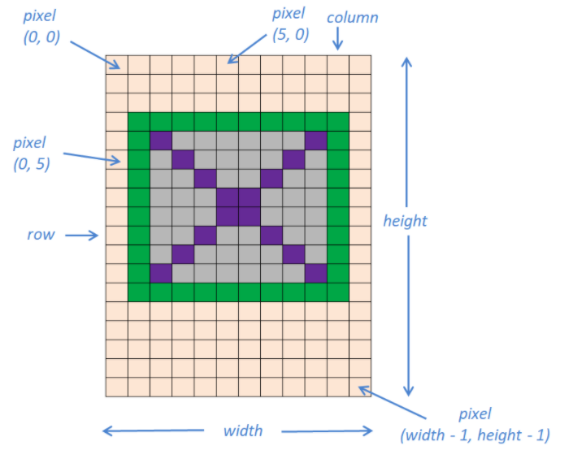

# Theory: Image colors

> In this topic, we'll learn about bitmap images that use the RGB or the ARGB color mode. A bitmap image consists of a 2-dimensional (2-D) matrix of dots, called pixels, each of which can be assigned a different color. These dots can be used to describe any kind of rectangular image. Common color translation schemes are the 24-bit RGB and 32-bit RGBA color models.

- bitmap 이미지에 대해서 알아보겠다. (RGB or ARGB)
- bitmap image 는 2 dimension matrix dot 으로 이뤄저있다.
- 각 점을 pixel 이라고 부르기도 하고 각 픽셀은 조그만한 직사각형 이미지라고 생각하면 된다.

***

## RGB Color, Alpha channel

> In most cases, the RGB color model is used with 24-bit data for each pixel. Hence, each pixel can have 16,777,216 different colors. This color scheme is called True Color.
> 
> An extension to the RGB is the ARGB color mode, which is similar to RGB colors but also contains opacity information. ‘A’ stands for Alpha or Alpha channel and denotes the transparency of each pixel. An Alpha value of 0 indicates that the pixel is clear, while the maximum value indicates that the pixel is opaque.
>
> Most commonly, ARGB is used with 32-bit data for each pixel. Each color and alpha channel is 8-bit long.
>
> The following image illustrates the 32-bit ARGB color scheme for a pixel. Each small rectangle denotes a single bit.
>
> 
> 
> Note that the actual use of the alpha channel data depends on the program. The data may be ignored, used for transparency or in some other manner in order to create some complex image blending.

- 각 픽셀은 RGB 의 경우 24 bit, ARGB 의 경우는 32 bit 로 이뤄져있다.

***

## Image coordinate system

> Java and consequently Kotlin use the BufferedImage class in order to handle images. It belongs to the java.awt package and is a subclass of the Image class. Therefore, it has to be imported into a program:
> 
> ````kotlin
> import java.awt.image.BufferedImage
> ````
> 
> A BufferedImage instance coordinate system is quite simple. A pixel position is defined by a pair of natural numbers that correspond to the pixel column and row respectively, with columns running from left to right and rows running from top to bottom. The starting row and column position number is zero. In the BufferedImage instance positioning system, the first coordinate is the column number, and the second is the row number. For example, a pixel with the position (4, 7) is located in the 5th column (from left to right) and in the 8th row (from top to bottom).
>
> 

- java 와 코틀린에서는 BufferedImage 를 통해서 이미지를 다룬다.
- BufferedImage 의 구조는 쉽다. (column, row) 로 구성된다.

***

## Read and Set pixel color

> A pixel’s color can be read as an integer using the getRGB(x, y) function, where x and y are the column and row pixel positions respectively. A Kotlin integer has a size of 32 bits, so it can hold the color values for both the 24-bit RGB and 32-bit ARGB color schemes.
>
> A pixel’s color can be set using the setRGB(x, y, rgb) function, where x and y are the column and row pixel positions respectively, and rgb is the pixel color as an integer.
>
> In order to easily work with the acquired color value and avoid bitwise operations, the Color class should be used. Color belongs to the Java java.awt package and has to be imported:
>
> ```kotlin
> import java.awt.Color
> ```
> 
> A Color instance can be initiated in many ways:
>
> - Color(rgb), where rgb is the integer value of 24-bit color read by the getRGB() function (without alpha channel);
> - Color(argb, true), where argb is the integer value of 32-bit color (with alpha channel);
> - Color(r, g, b), where r, g, and b are the values for each basic color;
> - Color(r, g, b, a) where r, g, and b are the values for each basic color, and a is the value of the alpha channel.
>
> In the following code example, an image file is read. Then, for each pixel in the created BufferedImage instance, the red color is set to 255, while the green and the blue colors remain unchanged. The BufferedImage instance is then saved as a new file. Note that a new Color instance has to be created.
>
> ```kotlin
> import java.io.File                   // Import the File class for file handling
> import javax.imageio.ImageIO          // Import the ImageIO class for reading and writing images
> import java.awt.image.BufferedImage   // BufferedImage Class
> import java.awt.Color                 // Color class
> 
> fun main() {
>     val inputFile = File("24bit.png")  // Create a file instance in order to read the "24bit.png" image file
> 
>     // Create a BufferedImage instance from the 24-bit image file data
>     val myImage: BufferedImage = ImageIO.read(inputFile)
>     
>     // myImage.width is the image width
>     // myImage.height is the image height
>     for (x in 0 until myImage.width) {               // For every column.
>         for (y in 0 until myImage.height) {          // For every row
>            val color = Color(myImage.getRGB(x, y))  // Read color from the (x, y) position
>     
>            val g = color.green              // Access the Green color value
>            val b = color.blue               // Access the Blue color value
>            // Use color.red in case the Red color is needed
>     
>            val colorNew = Color(255, g, b)  // Create a new Color instance with the red value equal to 255
>            myImage.setRGB(x, y, colorNew.rgb)  // Set the new color at the (x, y) position
>        }
>     }
>     val outputFileJpg = File("newImageFile.jpg")  // Output the file
>     ImageIO.write(myImage, "jpg", outputFileJpg)  // Create an image using the BufferedImage instance data
> }
> ```
> 
> The picture below illustrates the above code applied to the left image in order to produce the image on the right.

- BufferedImage 에서 getRGB(x,y) 를 통해서 Color 를 얻어올 수 있다.
- RGB 의 색깔을 다루기 위해서는 Color 클래스를 사용하면 편하다.
- BufferedImage 에 색깔을 넣기 위해서는 setRGB(x,y,color) 를 통해서 가능하다.
- BufferedImage 는 파일을 읽어와서 ImageIO 에 넣으면 된다.
- Color 의 인스턴스를 만드는 방법은 다양하다. rgb 값응ㄹ 그대로 넣으면 되고 따로따로 넣어도 된다.

***

## Set the Alpha channel

> In the following code example, a 32-bit image file with alpha channel is created. Alpha channel varies from 0 at the top of the image (total transparent) to 255 at the bottom (total opaque).
>
> ```kotlin
> import java.io.File
> import javax.imageio.ImageIO
> import java.awt.image.BufferedImage
> import java.awt.Color
> 
> fun main() {
> // Create a new BufferedImage instance with image size 256 X 256
> // The first parameter is the image width, while the second is the image height
> // The third parameter should be BufferedImage.TYPE_INT_ARGB for a 32-bit image
> // or BufferedImage.TYPE_INT_RGB for a 24-bit image
> val myImage: BufferedImage = BufferedImage(256, 256, BufferedImage.TYPE_INT_ARGB)
> 
>     for (i in 0 until myImage.width) {
>         for (j in 0 until myImage.height) {
>             myImage.setRGB(i, j, Color(0, 255, 0, j).rgb)  // Green color with alpha channel value equal to j
>         }
>     }
>     val outputFile = File("alpha.png")         // Output the image
>     ImageIO.write(myImage, "png", outputFile)  // Create an image using the BufferedImage
> }
> ```
> 
> And finally, here are some useful code snippets.
>
> ```kotlin
> // Get alpha value from Color instance
> val c = Color(255, 0, 0, 127)  // Create a color instance, with alpha equal to 127
> val alpha = c.alpha            // Get alpha channel value
> ```
> 
> Here we create a new Color instance with alpha channel. The alpha channel value is available through the alpha property.
>
> ```kotlin
> // Create Color instance for pixel at (x, y) position, alpha channel is also set
> val color = Color(bI.getRGB(x, y), true)  // where bI is a BufferedImage instance
> ```
> 
> The above code creates a new Color instance from the color of the bI BufferedImage instance at the position (x, y). If we didn't use this particular initiation with the second parameter set to true, then the alpha channel value at the position (x, y) would be ignored and set to value 255. This happens in the following code snippet. No matter what the alpha value was, it is disregarded and set to 255.
>
> ```kotlin
> // Create Color instance for pixel at (x, y) position, only RGB color (alpha set to 255)
> val color = Color(bI.getRGB(x, y))  // where bI is a BufferedImage instance
> ```

- BufferedImage 생성자를 통해서 바로 이미지를 만들 수 있다.
  - 넣을 변수로는 가로 길이, 세로 길이, RGB 로 할 건지 ARGB 로 할건지.
- ARGB 에서 Color 를 가져올 땐 ARGB 여부에 true 로 넣어주자. 그렇지 않으면 255 로 세팅해서 가져온다. 

