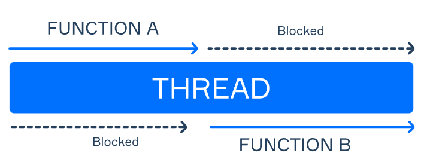
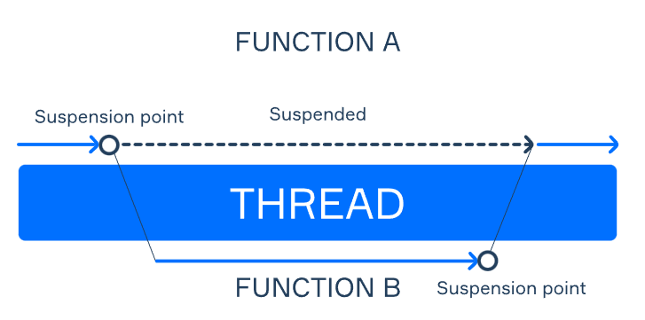

# Theory: Suspending functions

> A coroutine is a part of a program that can be suspended and resumed later. Kotlin doesn't pause a coroutine at an arbitrary point, though; it can only do that when a special suspending function is called. It keeps track of suspending functions and can run another one that was waiting for execution and then resume the original function when possible, even without switching threads at OS level. This mechanism potentially allows us to run many more coroutines than the limit of the available threads. Let's see what it exactly means to us as developers.

- 코루틴은 임의로 suspend 상태로 만들 수 없고 특수한 함수가 호출 되야만 가능하다.
- 코루틴은 OS level 의 context switching 이 필요없다.

***

## Suspend function

> Let's see how it works. When you call two simple functions, they run sequentially: a thread can execute only one function at a time:
>
> 
> 
> But what happens if a function becomes suspended? In this case, you can pause the execution of one function and run another one. The program will not forget about your paused function and will resume it later. This is especially useful when you need to wait for some external resource.
>
> 

- coroutine 에서 suspend 가 일어날 경우의 실행 흐름을 보여주는 그림들
- 주로 suspend 될 때는 I/O 작업같은 리소스를 가지고 오는 시간을 기다릴 때, blocking 될 때 일어난다.

***

## Use case example

> Imagine we need to run a lot of "heavy" operations like calculating the checksum for hundreds of files we received from the internet to make sure they aren't broken (that's what package managers or torrent clients do all the time).
>
> ```kotlin
> fun loadFile(): ByteArray {
>     return ... // long operation, actual code skipped for brevity
> }
> 
> fun calculateChecksum(fileData: ByteArray): String {
>     return ... // another long operation, actual code skipped for brevity
> }
> 
> fun main() {
>     for (i in 1..10_000) {
>         val fileData = loadFile()
>         val checksum = calculateChecksum(fileData)
>         println(checksum)
>     }
> }
> ```
> 
> To complete all calculations faster, we can process each file on a separate thread. However, it won't improve the performance if we have more files than the CPU cores because each core can only process one thread at a time. Moreover, if we have too many threads, we will run out of memory soon because each thread requires extra RAM just to start.
>
> ```kotlin
> fun main() {
>     for (i in 1..10_000) { // depends on the machine, rarely more than that
>         Thread {
>             val fileData = loadFileBlocking()
>             val checksum = calculateChecksum(fileData)
>             println(checksum)
>         }.start()
>     }
> }
> ```
> 
> ```kotlin
> import kotlinx.coroutines.*
> 
> suspend fun loadFile(): ByteArray { // now it's a suspending function
>     return ... // long operation
> }
> 
> suspend fun calculateChecksum(fileData: ByteArray): String { // another suspending
>     return ... // long operation
> }
> 
> // 'runBlocking' and 'async' build coroutines, we'll learn about it in the next topic
> //  so far you need to know that everything inside one of these builders is a coroutine
> fun main() = runBlocking {
>     for (i in 1..10_000) { // now we can have even more operations running concurrently
>         async {            // async schedules background execution of a given coroutine
>             val fileData = loadFile()
>             val checksum = calculateChecksum(fileData)
>             println(checksum)
>         }
>     }
> }
> ```

- 많은 시간이 걸리는 두 작업이 있다. 
  - 대량의 파일을 가지고 오는 작업
  - 가지고 온 파일로 체크섬을 계산하는 작업
- 이 작업들을 sequential 하게 진행한다고 생각해보면 엄청 오래걸린다.
- 그럼 많은 스레드를 만들어서 작업한다고 생각해보면 코어의 수가 파일의 수보다 월등히 작을 때 크게 효율을 발휘하지 못한다. 
- 그리고 그냥 많은 스레드를 만들면 그만큼 메모리 낭비가 심해진다.
- 코루틴은 runBlocking() 과 async 가 합쳐저서 코루틴을 만든다. 
- 코루틴을 설계하 땐 suspend 되는 작업과 그때 동안 실행할 작업을 명확히 구별해서 만들어두면 될 듯.

***

## Suspension points

> As we know, Kotlin can't suspend our code at arbitrary points; it can do that (but doesn't have to) when we call a suspending function – a function marked with the suspend keyword. Such a call is a "parking point" for a coroutine.
>
> JetBrains IDEs will mark these calls with a special symbol on the left.
>
> 
> 
> So our last example can start multiple operations concurrently because it can suspend at the loadFile call in the first launched coroutine and give room for the next one. Replace the suspending loadFile function with a regular one and you'll notice that the code will become sequential again even though we've built a coroutine with the async call. That's because there is no more suspension point in the async coroutine, and it will not let any other coroutine start until it finishes.
> 
> Coroutines need to "cooperate" to allow concurrency, and they cooperate via suspension. Cooperation is especially important for operations that do not require a lot of CPU but require a lot of waiting time for disk or networking requests (like our file loading). However, we can also use it for CPU-heavy tasks (like encoding) to introduce natural suspension points where an operation can be paused or canceled.

- 코루틴은 suspend 를 통해서 concurrency 를 이룰 수 있다.
- susepnd 는 함수 앞 키워드로 suspend 가 붙은 함수만을 멈출 수 있다.
- 이를 종합해보면 suspend 함수와 일반 함수를 같이 실행시키면 concurrency 하게 동작하지 않는다. 왜냐하면 양보를 안하니까.
- 코루틴은 멈추는 작업이 있는 경우. 블라킹 되는 작업이 있는 경우에 사용해야한다. 그래야 양보를 하고 그동안 다른 코루틴을 실행하니까.

***

## Suspend keyword

> So which function can be marked as suspending? Any! Methods, top-level functions, extension functions, and even lambdas can be suspending. Here's the definition of the async function we've used:
>
> ```kotlin
> public fun <T> CoroutineScope.async(
>     context: CoroutineContext = EmptyCoroutineContext,
>     start: CoroutineStart = CoroutineStart.DEFAULT,
>     block: suspend CoroutineScope.() -> T
> )
> ```
> 
> It declares the block parameter as a suspending extension function, and in our example we pass a three-line lambda expression to it. Note that we don't have to explicitly declare lambda as suspend, nor do we need to declare its parameters or return types.

- 어떠한 함수든지 코루틴이 될 수 있다.

***

## Suspending function invocation

> Suspending functions are great! So should we make all our functions suspending and use them everywhere? Not quite. Kotlin only allows calling suspending functions either from other suspending functions or from special coroutine builders like runBlocking and async (we'll learn more about them soon). And there is a reason for that: coroutines are cheap, but they are not free, and if we create them left and right, our code will become slower and harder to debug. So it's still a developer's job to figure out where we can benefit from suspending functions. For example:
> 
> - when we wait for some slow device like networks or disks;
> - when a long-running operation can be potentially canceled in the middle.

- 모든 function 을 코루틴을 쓸 필요는 없다. 코루틴이 싸긴 하지만 무료는 아니므로.
- 코루틴을 쓸려면 그리고 runBlocking 과 async 로 이뤄진 코루틴 빌더를 통해서만 실행이 가능하다.
- 주로 기다리는 작업에 코루틴을 쓰면 된다. 